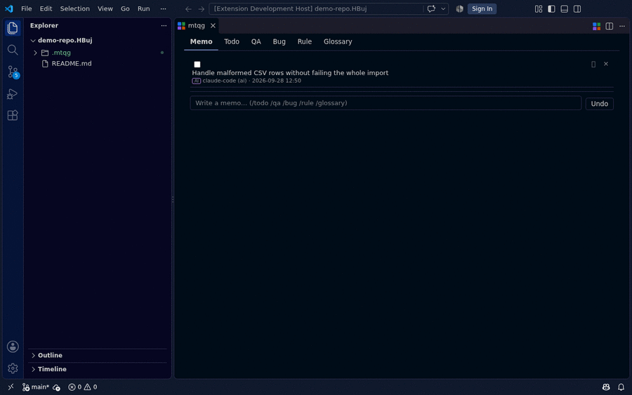

# mtqg for VS Code

*[日本語](README_ja.md) | **English***

  

<strong>Browse and write your mtqg project journal from inside the editor</strong>

  
  
  

  <a href="#features">Features</a> ·
  <a href="#prerequisites">Prerequisites</a> ·
  <a href="#usage">Usage</a> ·
  <a href="#learn-more">Learn more</a>

[mtqg](https://github.com/amisonnet8/mtqg) is a CLI that records memos, todos, questions & bugs, rules, and glossary terms (**m**emo & rules, **t**odo, **q**a & bugs, **g**lossary) as an append-only journal (`.mtqg/journal.jsonl`) right in a git repository -- for humans and AI agents. This extension assists with creating those records and shows their state and history from inside the editor. It does not add any new kind of data or operation: all reading and writing goes through the `mtqg` CLI (invoked with `--json`), and nothing in `.mtqg/` is read or written directly.

## Demo

  

## Features

- 💬 **Memo tab** -- a chat-like timeline of every record, newest at the bottom. Post a memo by default, or prefix a slash command (`/todo`, `/qa`, `/bug`, `/rule`, `/glossary`) to record something else
- ✅ **Todo tab** -- Google Keep-style cards with a checkbox for done/reopen
- 🧵 **QA and Bug tabs** -- threaded questions and bugs, with answers/replies always one input away
- 📖 **Rule and Glossary tabs** -- plain tables of adopted rules and defined terms
- 🕓 **Nothing silently disappears** -- editing and deleting a record leaves a visible trace, and every write can be undone right after it's made
- 🤖 **Built for humans and AI agents together** -- AI- and human-authored records sit in the same timeline, each with its own badge
- 🔗 **Type `@` to link a file** -- typing `@` in any input field opens a dropdown of workspace files; picking one inserts its path into the record's text

## Prerequisites

- `mtqg` 1.0.0 or later on your `PATH` -- see the [mtqg repository](https://github.com/amisonnet8/mtqg) for installation (`go install github.com/amisonnet8/mtqg/cmd/mtqg@latest`, or a prebuilt binary from its [Releases](https://github.com/amisonnet8/mtqg/releases))
- A workspace folder that is a git repository initialized with `mtqg init`

If `mtqg` is missing or older than this extension needs, a notification says so the first time you open the panel.

## Usage

Run **mtqg: Open** to open the mtqg panel, a chat-like view of your project's journal with six tabs (Memo, Todo, QA, Bug, Rule, Glossary). The Memo tab's input field posts a memo by default; prefix it with a slash command to record something else instead: `/todo`, `/qa`, `/bug`, `/rule`, `/glossary` (or the one-letter aliases `/t`, `/q`, `/b`, `/r`, `/g`).

Type `@` in any input field -- the Memo composer, an add row, a reply field, or an existing record you're editing -- to search workspace files and insert a path into the text.

### Commands

| Command | Title | Where |
|---|---|---|
| `mtqg.open` | mtqg: Open | Command Palette, editor title bar |

## Learn more

- [mtqg](https://github.com/amisonnet8/mtqg) -- the CLI this extension is a front end for
- [CHANGELOG](CHANGELOG.md)
- [Issues](https://github.com/amisonnet8/mtqg-vscode/issues)

## License

MIT
